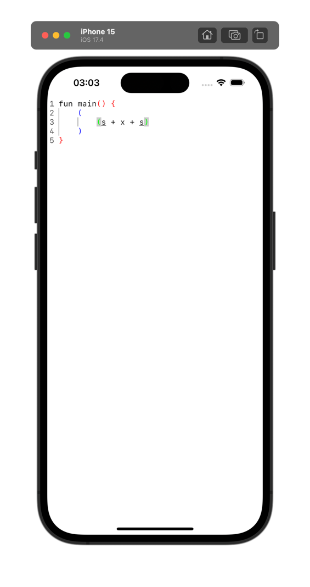

# SourceTextField

This project is a highly-extendable version of token-based Compose Multiplatform source code editor and helper functions.
It consists of 2 modules:
* `editor` is the main library module providing the artifacts.
* `composeApp` is an example app supporting a simple language based on regular bracket sequences.

  It targets Android, Desktop, iOS, WasmJS (experimental).

The editor does not implement additional functionality itself but provides extension points,
making the extension space not limited to the existing helper functions.

### Features
If you use existing helper functions you add support for:
* String preprocessors (such as replacing tabs with spaces)
* Token-based highlighting
* Automatic adding closing brackets (or other chars), indenting selected content
* Automatic indenting closing bracket (or other chars)
* Reusing closing bracket (or other chars)
* Automatic indentation
* Automatic removing several spaces at once during dedent
* Automatic removing closing bracket (or other chars) on deleting preceding opening bracket (or other chars)
* Showing indentation
* Sticky header
* Tab and Shift+Tab support for indentation
* Highlighting matching brackets
* Highlighting current matching brackets
* Highlighting same symbols

### Usage

The main entry point is
```kotlin
@Composable
fun <T : Token> BasicSourceCodeTextField(
    ...
)
```
which takes many parameters and extensions for extension points.
It is expected that users will provide all necessary extensions and wrap the function in something more convenient for end users.

See `CorrectBracketSequence` as an example.

!

### Drawbacks
As the editor is a pet project, it does not aim to replace full-fledged code editors, used in the modern IDEs as developing such would require a giant amount of time and work to do from scratch.
So, regular `BasicTextField` is used inside which does not support incremental changes and does not support lazy rendering.
* This leads to lagging on giant code sources (thousands of lines).
* Also, using `TextLayoutResult` API is impossible as I have to call too many times and it is rather expensive.
So, I have to rely on the fact that text is monospace (which is generally true for code) but breaks on R2L layout and some chars that don't take place. Nevertheless, both these cases are quite uncommon for code.
